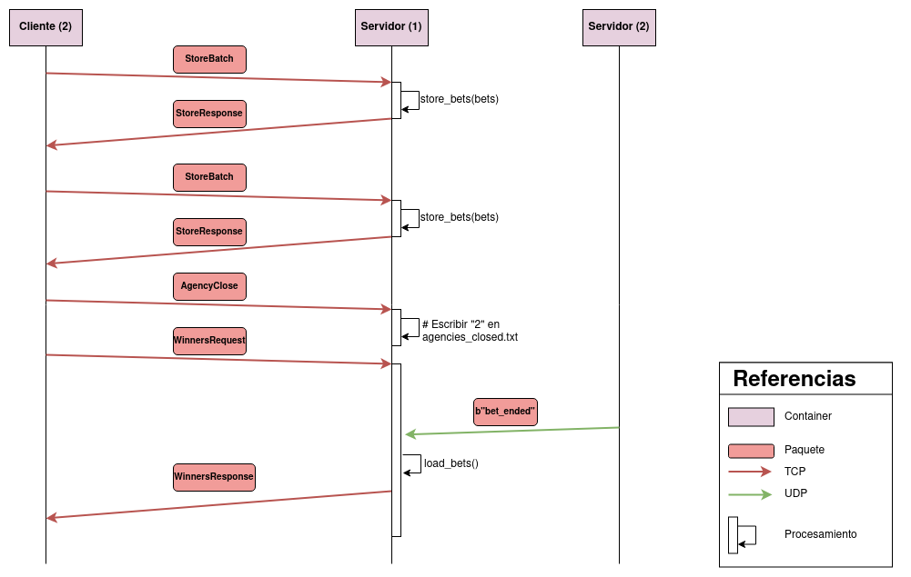

# TP0 - Sistemas Distribuidos I


## Tabla de contenidos

- [TP0 - Sistemas Distribuidos I](#tp0---sistemas-distribuidos-i)
  - [Tabla de contenidos](#tabla-de-contenidos)
  - [Enunciado](#enunciado)
  - [Ejecución de los ejercicios](#ejecución-de-los-ejercicios)
    - [Ejercicio 1](#ejercicio-1)
    - [Ejercicio 1.1](#ejercicio-11)
    - [Ejercicio 2](#ejercicio-2)
    - [Ejercicio 3](#ejercicio-3)
    - [Ejercicio 4](#ejercicio-4)
    - [Ejercicio 5](#ejercicio-5)
    - [Ejercicio 6](#ejercicio-6)
    - [Ejercicio 7](#ejercicio-7)
    - [Ejercicio 8](#ejercicio-8)
  - [Configuración](#configuración)
    - [Variables de entorno](#variables-de-entorno)
    - [Configuración de los clientes](#configuración-de-los-clientes)
      - [Valor máximo de `batch_size`](#valor-máximo-de-batch_size)
    - [Configuración de los servidores](#configuración-de-los-servidores)
  - [Protocolo de comunicación cliente-servidor](#protocolo-de-comunicación-cliente-servidor)
    - [Tamaño del paquete](#tamaño-del-paquete)
    - [Codificación de los paquetes](#codificación-de-los-paquetes)
    - [Tipo de paquete](#tipo-de-paquete)
    - [Paquetes](#paquetes)
      - [StoreBet](#storebet)
      - [StoreBatch](#storebatch)
      - [StoreResponse](#storeresponse)
      - [AgencyCLose](#agencyclose)
      - [WinnersRequest](#winnersrequest)
      - [WinnersResponse](#winnersresponse)
      - [NotReadyResponse](#notreadyresponse)
  - [Características de la Arquitectura del Servidor](#características-de-la-arquitectura-del-servidor)
    - [Comunicación y sincronización entre servidores](#comunicación-y-sincronización-entre-servidores)
    - [Archivos compartidos](#archivos-compartidos)

## Enunciado
[Link al enunciado](enunciado.md)

## Ejecución de los ejercicios

### Ejercicio 1

Para verificar que se agregó un nuevo cliente al proyecto, ejecutar:

    $> make docker-compose-up

Al finalizar, se espera un output similar al siguiente:
```bash
[+] Running 3/3
 ⠿ Container server   Started                                0.7s
 ⠿ Container client2  Started                                1.1s
 ⠿ Container client1  Started                                1.1s
```

### Ejercicio 1.1

Correr el script con el siguiente comando:

    $> python3 scripts/write_compose.py <NUMBER_OF_CLIENTS>

### Ejercicio 2

Para verificar que funcionan los volúmenes, ejecutar:

    $> make docker-compose-up

Modificar el archivo `server/config.ini`. Luego, ingresar en el container del servidor y confirmar
que el archivo fue modificado:

    $> docker exec -it server bash
    $> cat config.ini

### Ejercicio 3

El siguiente comando levanta los containers y envía dos mensajes al servidor, utilizando netcat:

    $> make RERUN=1 test-netcat-auto

Se espera el siguiente output:

```bash
docker exec netcat sh -c "echo 'Hello World!' | nc server 12345"
Hello World!
docker exec netcat sh -c "echo 'Elian Foppiano' | nc server 12345"
Elian Foppiano
```

Para enviar mensajes manualmente, ejecutar:

    $> make RERUN=1 test-netcat-manual
    $> echo 'Mensaje' | nc server 12345


### Ejercicio 4

Ejecutar:

    $> make docker-compose-up
    $> make docker-compose-stop
    $> docker compose -f docker-compose-dev.yaml logs | grep "shutdown "

Y confirmar que todos los containers se detuvieron correctamente.

### Ejercicio 5

Ejecutar:

    $> make docker-compose-up
    $> docker compose -f docker-compose-dev.yaml logs | grep apuesta_enviada
    $> docker compose -f docker-compose-dev.yaml logs | grep apuesta_almacenada


### Ejercicio 6

Copiar los archivos de apuestas de las agencias a la carpeta `.data`.

Ejecutar:

    $> make docker-compose-up

Verificar que se almacenaron todas las apuestas ejecutando:

    $> docker exec server sh -c "wc -l bets.csv"
    $> wc -l .data/*

### Ejercicio 7

Ejecutar:

    $> make docker-compose-up
    $> docker compose -f docker-compose-dev.yaml logs | grep sorteo
    $> docker compose -f docker-compose-dev.yaml logs | grep consulta_ganadores

### Ejercicio 8

Ejecutar:

    $> mv .env.example .env
    $> make docker-compose-up
    $> docker compose -f docker-compose-dev.yaml logs | grep sorteo
    $> docker compose -f docker-compose-dev.yaml logs | grep consulta_ganadores

El siguiente comando testea el servidor, ejecutando 100 veces el target `make docker-compose-up`,
y verificando que en cada ejecución se obtengan las cantidades correctas de ganadores para cada
agencia:

    $> ./scripts/integration_test.sh

## Configuración

### Variables de entorno

Las variables de entorno se definen en el archivo `.env` en la raíz del proyecto.

El archivo `.env.example` contiene un ejemplo de las variables que se deben definir.

- `CLIENTS`: Cantidad de clientes que se van a conectar al servidor o servidores

- `SERVERS`: Cantidad de servidores que se deben levantar

- `SERVER_NAME`: Nombre del servidor. Los clientes utilizan este nombre para conectarse al servidor, en
lugar de la IP.

- `SERVER_PORT`: Puerto en el que los servidores escuchan las conexiones de los clientes.

- `DOCKET_SUBNET`: Subred en la cual se levanta la red de Docker.

### Configuración de los clientes

Los clientes se configuran en el archivo [client/config.yaml](./client/config.yaml).

- `server.address`: Dirección y puerto del servidor al cual se conecta el cliente. Debe ser igual a
`SERVER_NAME:SERVER_PORT` definido en el archivo `.env`.

- `batch_size`: Cantidad de apuestas que se pueden enviar al mismo tiempo, en un único mensaje batch.
Debe ser menor o igual a 63.

- `retry_sleep`: Tiempo unitario de espera entre reintentos de obtención de ganadores.
Luego del primer intento, se espera `retry_sleep`, luego `retry_sleep * 2`, luego `retry_sleep * 4`, etc.

- `retry_sleep_max`: Tiempo máximo de espera entre reintentos de obtención de ganadores.
Si el tiempo de espera entre reintentos supera este valor, se espera `retry_sleep_max`.

- `log.level`: Nivel de log. Puede ser `debug`, `info`, `warn`, `error` o `fatal`.

#### Valor máximo de `batch_size`

Con el objetivo de definir con exactitud el tamaño máximo de un paquete, se limitó la longitud
máxima de ciertos campos de la apuesta. Estos son:

- Nombre: 50 bytes
- Apellido: 50 bytes
- Documento: 10 bytes
- Fecha de nacimiento: 10 bytes
- Número: 4 bytes

Por lo tanto, el tamaño máximo de una apuesta, considerando los 5 separadores de campos, es:

    50 + 50 + 10 + 10 + 4 + 5 = 129 bytes

La última apuesta posee un caracter delimitador menos, pero esto no afecta al resultado final, y no
se considera en el cálculo por simplicidad.

Como el tamaño máximo del payload de un paquete es 8190 bytes (8192 menos 2 bytes para el campo de tamaño del paquete,
ver [Protocolo de comunicación cliente-servidor](#protocolo-de-comunicación-cliente-servidor)),
y que además se debe considerar el tamaño del campo de tipo de paquete, y el número de agencia, se
obtiene que el valor máximo de `batch_size` es:

    floor((8192 - 2 - 10 - 3)/129) = 63


### Configuración de los servidores

Los servidores se configuran en el archivo [server/config.ini](./server/config.ini).

- `SERVER_PORT`: Puerto en el que el servidor escucha las conexiones de los clientes. Debe ser igual a
`SERVER_PORT` definido en el archivo `.env`.

- `SERVER_LISTEN_BACKLOG`: Cantidad de conexiones pendientes que se pueden mantener en la cola de
espera.

- `AGENCIES_AMOUNT`: Cantidad de agencias que se van a simular. Los servidores esperarán a que todas
se cierren para realizar el sorteo. Debe coincidir con la variable `CLIENTS` definida en el archivo
`.env`.

- `LOGGING_LEVEL`: Nivel de log. Puede ser `NOTSET` `DEBUG`, `INFO`, `WARNING`, `ERROR` o `CRITICAL`.


## Protocolo de comunicación cliente-servidor

### Tamaño del paquete

Los primeros 2 bytes de cada paquete indican el tamaño del paquete en bytes, sin contar estos 2 bytes.
Por lo tanto, dicho tamaño debe ser menor o igual a 8190 (8 kB - 2 B).

El tamaño se codifica en formato **big-endian**.

| Bytes                     | Contenido     |
|---------------------------|---------------|
| 0 ... 1                   | Packet Length |
| 2 ... (Packet Length + 1) | Payload       |


### Codificación de los paquetes

El resto del paquete se codifica en formato utf-8.


### Tipo de paquete

El primer segmento de cada paquete es el tipo de paquete, y se separa del resto del paquete con un
carácter `:`.

### Paquetes

#### StoreBet

Es enviado por el cliente al servidor para almacenar una apuesta individual.

El cliente debe esperar recibir un paquete `StoreResponse` antes de enviar cualquier otro paquete.

- Formato (payload): `StoreBet:agencia;nombre;apellido;documento;nacimiento;numero`
- Ejemplo: `StoreBet:1;Juan;Perez;12345678;1980-01-01;1234`

#### StoreBatch

Es enviado por el cliente al servidor para almacenar un lote de apuestas.

El cliente debe esperar recibir un paquete `StoreResponse` antes de enviar cualquier otro paquete.

Cada apuesta se separa con un carácter `:`.

- Formato (payload): `StoreBatch:agencia;nombre;apellido;documento;nacimiento;numero:...:nombre;apellido;documento;nacimiento;numero`
- Ejemplo: `StoreBatch:1;Juan;Perez;12345678;1980-01-01;5423:Maria;Gomez;87654321;1999-10-25;1234`

#### StoreResponse

Es enviado por el servidor al cliente para responder a un paquete `StoreBet` o `StoreBatch`.

- Formato (payload): `StoreResponse:status`
- Ejemplo: `StoreResponse:0`

- status == 0: La o las apuestas se almacenaron correctamente.
- status == 1: Hubo un error al almacenar la o las apuestas.

#### AgencyCLose

Es enviado por el cliente al servidor para indicar que una agencia cerró.

Una vez enviado, la agencia no puede enviar más apuestas.
El servidor debe esperar recibir un paquete `AgencyClose` de todas las agencias antes de realizar el
sorteo.

- Formato (payload): `AgencyClose:agencia`
- Ejemplo: `AgencyClose:1`

#### WinnersRequest

Es enviado por el cliente al servidor para solicitar los ganadores del sorteo correspondiente a la
agencia especificada.

Si el sorteo ya se realizó, el servidor responde con un paquete `WinnersResponse`. En caso contrario,
el servidor responde con un paquete `NotReadyResponse`.

- Formato (payload): `WinnersRequest:agencia`
- Ejemplo: `WinnersRequest:1`

#### WinnersResponse

Es enviado por el servidor al cliente para responder a un paquete `WinnersRequest` cuando el sorteo
ya se realizó.

Contiene los documentos de los ganadores del sorteo correspondiente a la agencia solicitada.

- Formato (payload): `WinnersResponse:documento1;documento2;...;documentoN`
- Ejemplo: `WinnersResponse:34054835;38955439`

#### NotReadyResponse

Es enviado por el servidor al cliente para responder a un paquete `WinnersRequest` cuando aún hay
agencias que no cerraron.

- Formato (payload): `NotReadyResponse:`

Nota: El paquete `NotReadyResponse` no contiene ningún dato adicional, pero el caracter `:` es
necesario para mantener la consistencia del protocolo.

## Características de la Arquitectura del Servidor

- Multiprocessing
- Cada instancia servidor corre en un container distinto, en la misma subred, y con el mismo alias
  de DNS.
- Cada instancia procesa las conexiones de manera secuencial
- Los clientes se conectan utilizando el nombre del servidor, y el DNS de Docker se encarga de redirigir las
  conexiones a la instancia que corresponda.

### Comunicación y sincronización entre servidores

### Archivos compartidos

- **Archivo de apuestas**, donde se almacenan las apuestas de todas las agencias.
  (`/shared-volume/bets.csv` en el container, `server/shared-volume/bets.csv` en el host)
- **Archivo con los números de agencias que ya cerraron** (`/shared-volume/agencies_closed.txt` en el
  container, `server/shared-volume/agencies_closed.txt` en el host). Este archivo se utiliza para
  determinar cuándo se puede realizar el sorteo.
- Cada archivo se encuentra protegido con un FileLock diferente, para evitar race conditions.




Diagrama de secuencia de la comunicación entre los clientes y los servidores.
